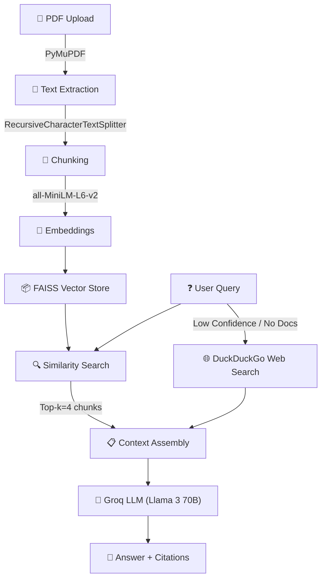

# ResearchMind 🔍

> Multi-document RAG chatbot with Agentic web fallback — built with React (Vite), FastAPI, FAISS, SQLite, and Groq (Llama 3)

---

## 🏗️ Architecture



---

## ✨ Features

### 💬 Multi-Document RAG Chat
- Upload multiple PDF documents simultaneously.
- Ask questions and get answers grounded in your documents.
- Source citations with document name and page number rendered dynamically.
- Confidence indicator (🟢 HIGH / 🟡 MEDIUM / 🔴 LOW) based on matching similarity scores.

### 🌐 Agentic Web Fallback
- If the document similarity confidence score is LOW, the chatbot automatically triggers a DuckDuckGo search to augment the response.
- If no documents are uploaded, the chatbot falls back to web search mode seamlessly.

### 🛡️ User Authentication & Guest Mode
- Native authentication system with secure password hashing (`bcrypt`).
- Guest mode allows users to start chatting immediately.
- Automatic session-claiming moves guest chats and vector indices to the permanent account upon registration/login.

### 📂 Interactive Sidebar
- Create new chat threads.
- Pin, archive, and delete recent chats.
- Upload documents on a per-session basis to isolate vector contexts.

---

## 🛠️ Tech Stack

| Component | Technology |
|-----------|------------|
| **Frontend** | React, Vite, GSAP, CSS Variables (Dark theme) |
| **Backend** | FastAPI, Uvicorn, Python-Multipart |
| **Database** | SQLite via `aiosqlite` |
| **LLM** | Llama 3 via [Groq](https://groq.com) |
| **Embeddings** | [Sentence-Transformers](https://huggingface.co/BAAI/bge-small-en-v1.5) (`BAAI/bge-small-en-v1.5`) |
| **Vector Store** | [FAISS](https://github.com/facebookresearch/faiss) (CPU) |
| **Orchestration** | [LangChain](https://langchain.com) |
| **PDF Parsing** | [PyMuPDF](https://pymupdf.readthedocs.io/) |

---

## 📂 Project Structure

```
researchmind/
├── api/
│   ├── database.py         # SQLite connection and user queries
│   └── main.py             # FastAPI backend with static files fallback
├── rag/
│   ├── loader.py           # PDF parsing and document chunk splitting
│   ├── embedder.py         # Vector embeddings generation and local storage
│   ├── retriever.py        # Similarity search and confidence level calculation
│   └── chain.py            # LangChain Groq inference and web search fallback
├── frontend/
│   ├── src/
│   │   ├── components/     # UI elements (AuthModal, Sidebar, UserProfileDropdown, MessageBubble)
│   │   ├── App.jsx         # Chat layout, API stream reader, and session setup
│   │   └── index.css       # Premium glassmorphic Dark design styles
│   └── package.json
├── utils/
│   └── helpers.py          # Environment key validation and string helpers
├── Dockerfile              # Docker script packaging React & FastAPI
├── requirements.txt        # Backend python dependencies
├── .env.example            # Backend local environment keys template
└── README.md               # Project documentation
```

---

## 🚀 How to Run Locally

### Prerequisites
- Python 3.10+
- Node.js 18+
- A [Groq API Key](https://console.groq.com)

### 1. Set Up Environment Variables
Copy `.env.example` to `.env` in the root directory and fill in your Groq API Key:
```env
GROQ_API_KEY=your_groq_api_key_here
```

### 2. Run the Backend
From the root directory:
```bash
# Create and activate virtual environment
python -m venv .venv
source .venv/bin/activate   # Linux/Mac
.venv\Scripts\activate      # Windows

# Install backend dependencies
pip install -r requirements.txt

# Start the FastAPI server
uvicorn api.main:app --host 0.0.0.0 --port 8000 --reload
```

### 3. Run the Frontend
In a new terminal window:
```bash
cd frontend
npm install
npm run dev
```
Open [http://localhost:5173](http://localhost:5173) in your browser.

---

## 🌐 Production Deployment

### Option A: Running as a Single Container (Recommended)
The project includes a multi-stage `Dockerfile` which builds the React frontend and packages it inside the FastAPI backend. FastAPI then automatically serves the static assets at the root path `/`.

1. **Build the Docker Image**:
   ```bash
   docker build -t researchmind .
   ```

2. **Run the Container**:
   ```bash
   docker run -p 8000:8000 --env GROQ_API_KEY="your_groq_api_key" researchmind
   ```
   Open [http://localhost:8000](http://localhost:8000) to access the complete application.

### Option B: Deploying to HuggingFace Spaces
1. Create a new Space on [Hugging Face](https://huggingface.co/new-space).
2. Select **Docker** as the SDK (instead of Streamlit).
3. Set `GROQ_API_KEY` under the **Repository Secrets** in Space settings.
4. Push the codebase to your space's git remote. The Hugging Face builder will execute the `Dockerfile` automatically and spin up the container.

---

## 📜 License

This project is open-source and available under the [MIT License](LICENSE).
